### Hi I'm Lucas "Omena" 👋

- 👨‍💻 I’m currently working as Cloud Consultant / Cloud Engineer / SRE / Cloud Automation / DevOps Engineer at Accenture 
- 📫 How to reach me: 
  - 📞 Mobile: +1 (672) 558-5376
  - 📨 E-mail: lucasomena5@gmail.com

  <a href="https://github.com/lucasomena5">
  
  

<!--

 
  
  
  
  
  
  
  
  
  
  
    
    

-->

    
  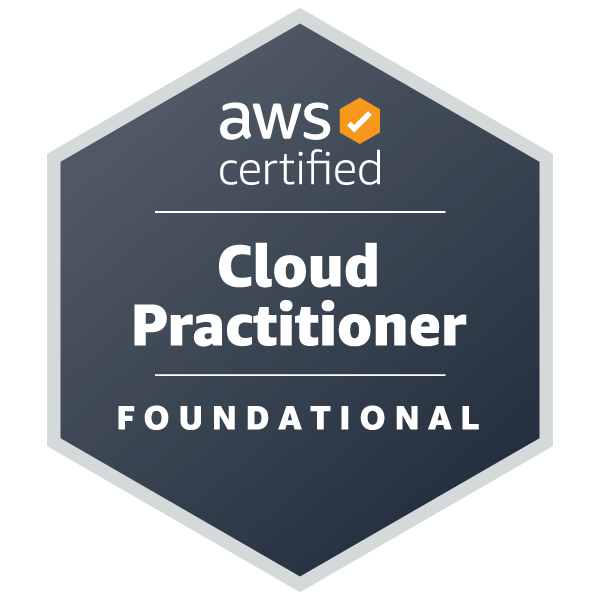
  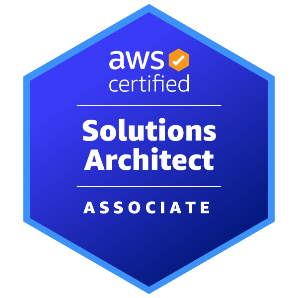
  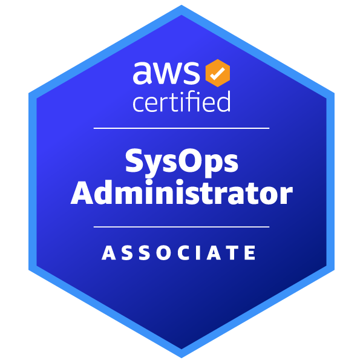
  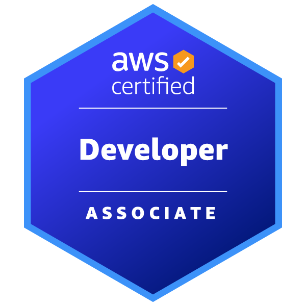
  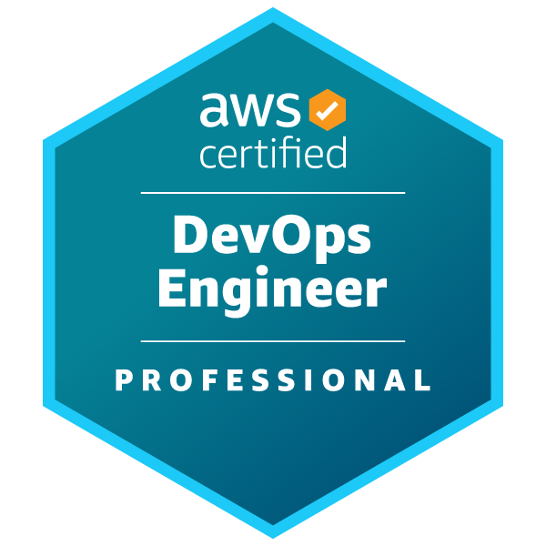
  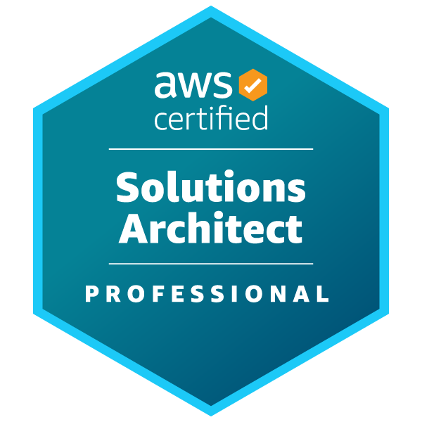
  
    
  
  
    
  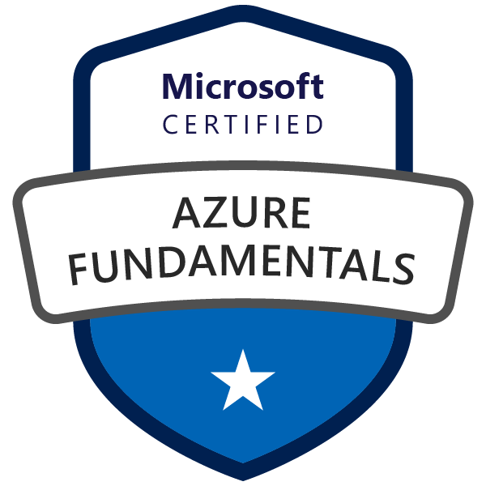
  
  
  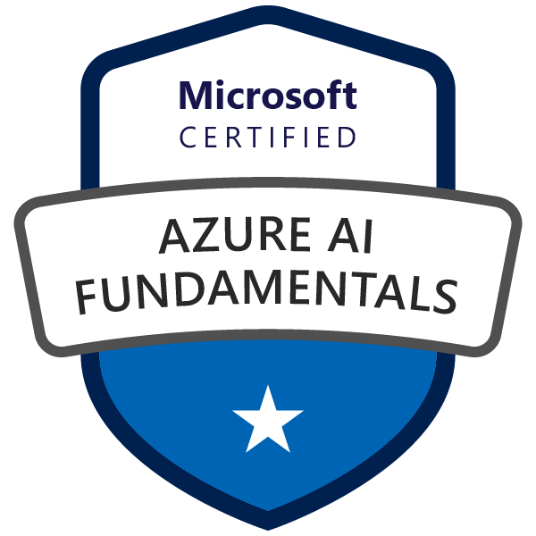
  
  
    
  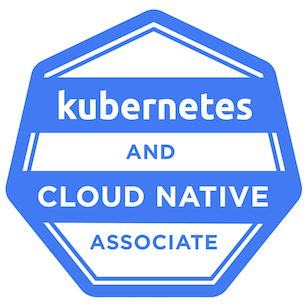
  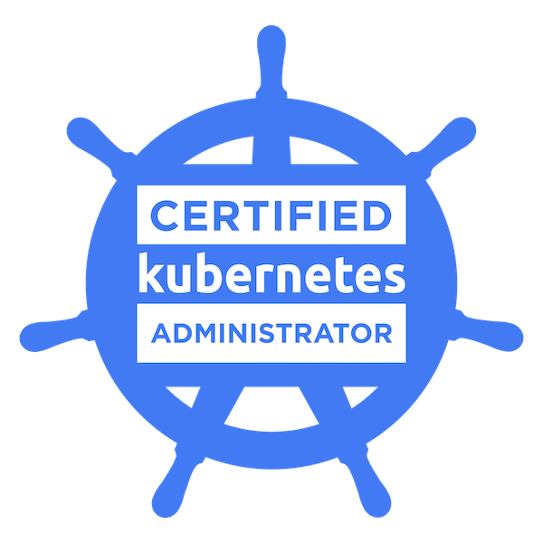
  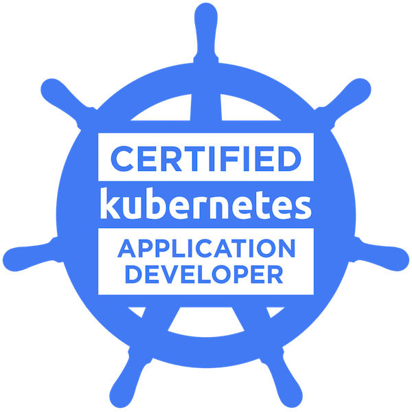
    
  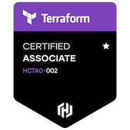
    
  

 

    
  

    &nbsp;&nbsp;&nbsp;&nbsp;
    &nbsp;&nbsp;&nbsp;&nbsp;
    &nbsp;&nbsp;&nbsp;&nbsp;
    &nbsp;&nbsp;&nbsp;&nbsp; 
    &nbsp;&nbsp;&nbsp;&nbsp; 
  

  <!---->

